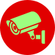

# Camera IP - RSTP



## Introdução

À medida que as câmeras IPs se popularizaram, muitas pessoas passaram a ter acesso e instalar esses dispositivos em suas residências. Apesar da facilidade de instalação, acabam se tornando reféns de aplicativos que muitas vezes exigem pagamento, restringem o monitoramento a uma única marca de dispositivos ou necessitam de conexão com a internet/smartphone para utilização.

Esta aplicação tem como objetivo fornecer a possibilidade de visualizar diversas câmeras através do protocolo RTSP, acessando os dispositivos diretamente em uma rede local e permitindo o monitoramento simultâneo de vários dispositivos de diferentes marcas.

O foco desta aplicação são usuários linux, pois estes possuem menos opções para de aplicações que cumpram esses objetivos, mas a aplicação é multiplataforma  e pode ser utilizada em qualquer sistema operacional.


## Capturas de tela


## Ambiente de desenvolvimento

Clone o repositório e acesse a pasta do projeto.

Para criar o ambiente virtual execute os seguintes comandos:

```sh

    python -m venv .venv

    source .venv/bin/activate

    pip install -r requiriments.txt

```

Execute o projeto com o comando:

```sh

    python main.py

```